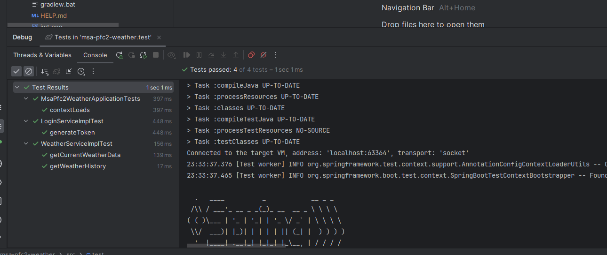

# WEATHER API

***Reto técnico***

Se presenta un microservicio que se integra con el api https://openweathermap.org
para obtener información actual del tiempo y con https://auth0.com para generar un token JWT que permite asegurar las
APIs.

La solución está diseñada bajo una arquitectura tradicional con lo siguiente:

- Se aplicó principios SOLID (ejemplo: Responsabilidad única, Inyección de dependencias, etc)
- Se separó por capas los diferentes componentes
- Se implementó el patron Factory para administrar los clientes http
- Se usó singleton
- DTO
- Control global de excepciones
- etc

También en esta solución se integra con una DB en memoria para poder cumplir con los requisitos planteados

### Diagrama de base de datos

Para la solución se utiliza únicamente la siguiente tabla SQL

### Test unitarios

Se realizó test unitarios de los principales escenarios y se obtuvo éxito en todos como se muestra en la imagen adjunta

### ¿Cómo funciona?

Se generó y subió la siguiente imagen https://hub.docker.com/repository/docker/bladiminga46/spring-boot-app/general en
dockerhub.
En la solución también existe un archivo Dockerfile para construir una imagen local y de la misma manera, en la carpeta
helms
se encuentran los archivos necesarios para ejecutar la aplicación en un entorno de kubernetes.

### USO

Una vez iniciada la aplicación, sea por docker, kubernetes o simplemente clonando el presente repositorio se puede
visualizar
el siguiente contenido http://localhost:8080/api/v1/swagger-ui/index.html

en la cual tenemos expuestos tres ENDPOINTs RESTFULL.

El Endpoint **/public/token** permite generar automáticamente un token JWT desde el oauth implementado.
(Este endpoint por temas prácticos se lo puso aquí, pero en un entorno real se debe separar en otro microservicio)

Luego con el token generado, se puede consumir los endpoints del controlador Weather enviando el JWT en la cabecera
Autorization

### CREDENCIALES

Las credenciales utilizadas para las diferentes conexiones se encuentran quemadas en las properties de esta solución.
Igualmente esto por temas prácticos, ya que en un entorno real se debe utilizar variables de entorno.

Variables utilizadas:

oauth:

- issuer: https://dev-110uie3k4jjd8cey.us.auth0.com/
- audience: localhost/api/v1/weather
- client-id: JpuDQyqEAgLi5bShYQiOnnE3jSd5p2NS
- client-secret: KXNirbKbgTy3qThwyNEou68ypm7aXvZWks9SlIRMbWSW9lDrjd38Kdso9ZTFuLJN
- grant-type: client_credentials

open-weather:

- app-id: ab9da5dbd643711d7007d938b2accf3a

urls:

- open-weather-map: https://api.openweathermap.org/data/2.5/weather
- auth: https://dev-110uie3k4jjd8cey.us.auth0.com/oauth

### Recomendaciones

Se puede agregar a los requerimientos lo siguiente:

- Implementación de un RestControllerAdvice.
- Pruebas unitarias
- Spring validations

